# **LibraryManagementSystem**

> This project was developed as an Exam in the Python For Software Engineering Course at [Pacmann.AI Data Science Programm](https://pacmann.io/sekolah-data-science).

## Rubics

1. Running Program Features
  - Library member registration
  - New book registration
  - Borrowing
  - Displays Member data, Books, and Return lists
  - Can do a book search
2. Successful Transaction Processing program with database 
  - Member Data
  - Book Data
  - Return Data
  - The program is built by taking into account the Functional Concept or Object Oriented Programming.
3. Clean Code (Documentation)

## Overview

This is a simple console-based library system created using Python with the following functions:
1. Search Book
2. Check Out (Borrow) Book
3. Check In (Return) Book
4. Account & Membership Maintenance
5. Book Management
6. Records
7. Exit

This system applies structured programming approach.

## Preview
1. Main Menu   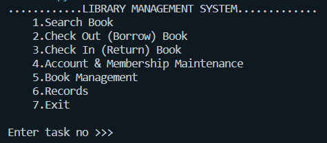 
2. Main Menu with Error Notification   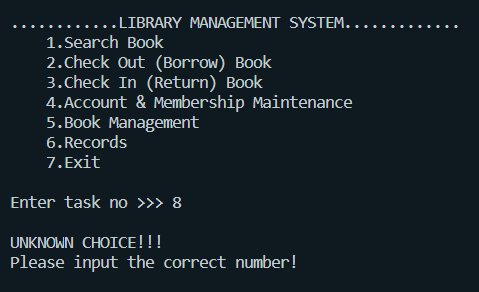 
3. Account & Membership Maintenance 
  * Add New Account   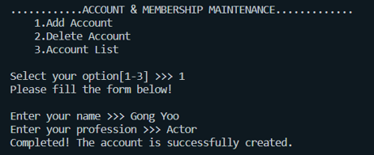 
  * Account List After Add Account   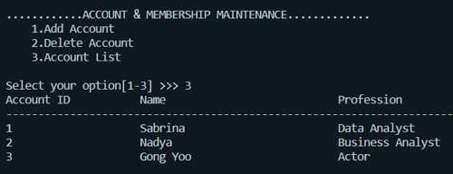 
  * Delete Account   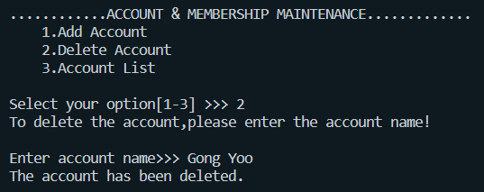 
  * Account List After Delete Account   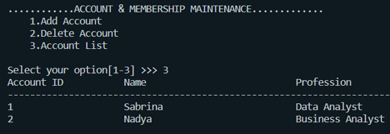 
4. Book Management 
  * Add New Book   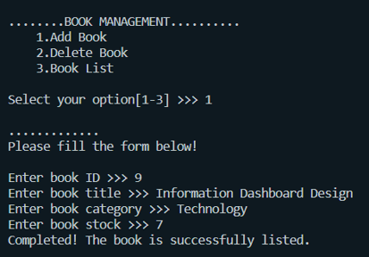 
  * Book List After Add Book   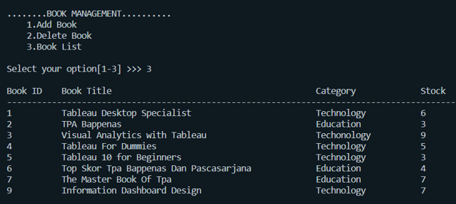 
  * Delete Book   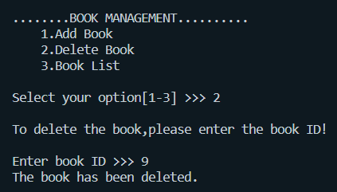 
  * Book List After Delete Book   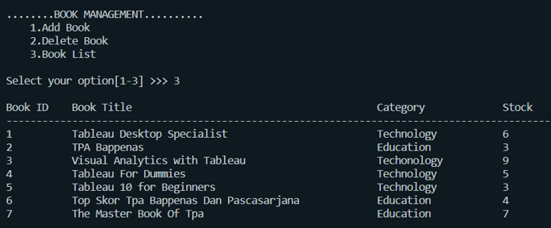 
5. Search Book
  * Search by Book ID   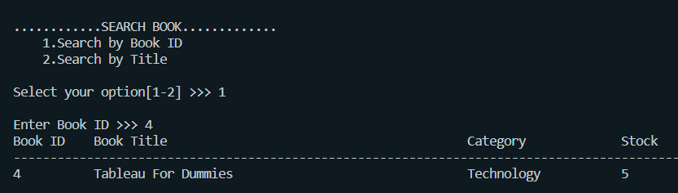 
  * Search by Book Title   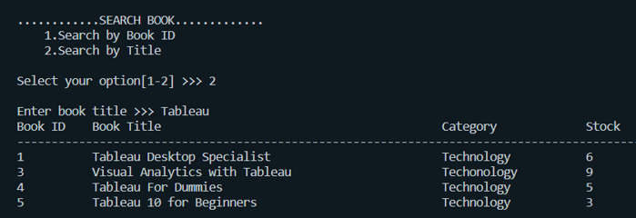 
6. Check Out (Borrow) Book 
  * Search available book by Book Title   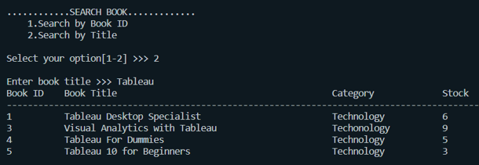 
  * Fill The Check Out (Borrow) Form   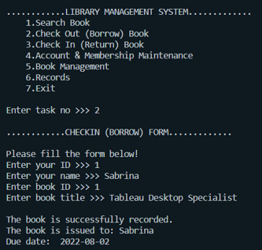 
  * Check The Check Out (Borrow) Records   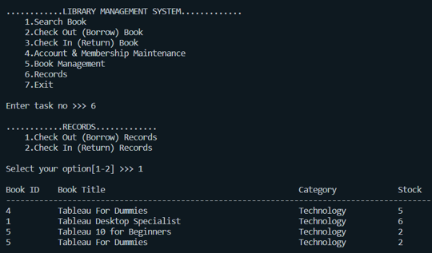 
7. Check In (Borrow) Book 
  * Search available book by Book Title   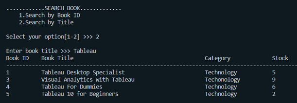 
  * Fill The Check In (Return) Form   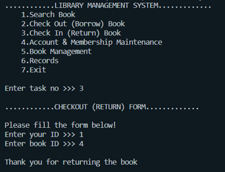 
  * Check The Check In (Return) Records   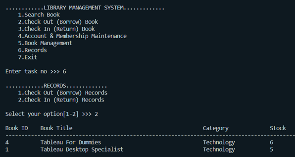 
8. Exit   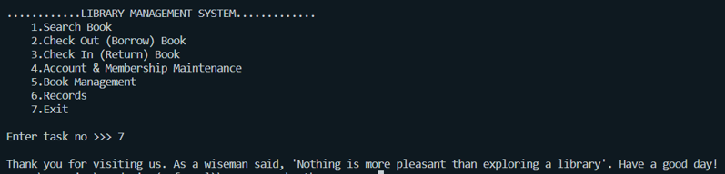 

## Authors

[Sabrina Pribadi](https://www.linkedin.com/in/sabrinapribadi/)

## Acknowledgments

Inspiration, code snippets, etc.
* [Yuanjie8269-LibrarySystem](https://github.com/yuanjie8629/LibrarySystem/tree/12886d363664d102ec1ac8878728663af849ba50)
